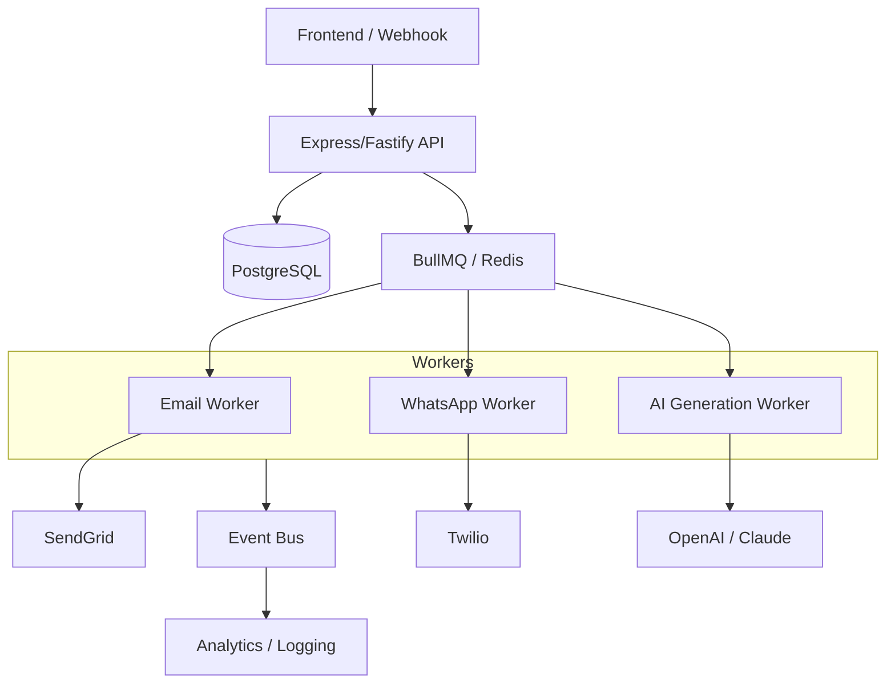

# Architecture Outline: SalesPad Outbound Sales Automation

## 1. Core Backend Architecture
The system is built using a **Modular Monolith** architecture (for early-stage speed and simplicity) transitioning towards **Microservices** as team size and scale grow.
- **Language/Framework**: Node.js with TypeScript & Fastify/Express.
- **API Style**: RESTful API for external/frontend interaction.
- **Concurrency**: Asynchronous non-blocking I/O to handle high-volume event processing.

## 2. Database & Data Structures
We use a relational database (**PostgreSQL**) to ensure ACID compliance for lead states and interaction history.

### Core Entities:
- **Lead**: `id`, `name`, `email`, `phone`, `status` (NEW, OUTREACHED, REPLIED, CONVERTED), `metadata`.
- **Channel**: `id`, `type` (EMAIL, WHATSAPP, LINKEDIN), `config` (API keys, etc.).
- **Message**: `id`, `leadId`, `channelId`, `direction` (INBOUND, OUTBOUND), `content`, `sentAt`.
- **EventLog**: `id`, `leadId`, `eventType` (LEAD_CREATED, EMAIL_SENT, REPLY_RECEIVED), `timestamp`, `details`.

## 3. Queue & Retry Logic
Outbound outreach and AI heavy-lifting are designed to be handled by **BullMQ** (powered by Redis).

> **Note for Prototype**: This implementation uses a robust in-memory `MockQueueService` to simulate async processing and retries without requiring a local Redis instance.

- **Delayed Jobs**: For scheduled follow-ups.
- **Retry Strategy**: Exponential backoff for transient failures (e.g., SMTP 421 errors, AI rate limits).
- **Dead Letter Queues (DLQ)**: For messages that fail after maximum retries, alerting sales ops for manual intervention.

## 4. Module/Service Breakdown
- **Ingestion Service**: Handles lead capture from various sources (webhook, UI, CSV).
- **Outreach Orchestrator**: Manages the multi-step outbound flow.
- **Channel Adapters**: abstracting the complexity of different providers (SendGrid, Twilio, LinkedIn API).
- **AI Intelligence Layer**: Handles intent classification and draft generation using LLMs (GPT-4 / Claude).
- **Status/Analytics Service**: Aggregates event logs for reporting.

## 5. Frontend-Backend Interaction
- **Real-time Updates**: WebSocket (Socket.io) or Server-Sent Events (SSE) to update the dashboard when a prospect replies.
- **State Management**: React-Query on the frontend to manage server state and optimistic updates.

## 6. Multi-Channel Approach
We use an **Adapter/Strategy Pattern**. Each channel (Email, WhatsApp, etc.) implements a common interface:
```typescript
interface OutreachChannel {
  send(lead: Lead, content: string): Promise<SendResult>;
  validateRecipient(lead: Lead): boolean;
}
```
This allows the `Outreach Orchestrator` to remain channel-agnostic, simply picking the right adapter based on the lead's preferred channel or the sequence configuration.

## 7. Architecture Diagram


